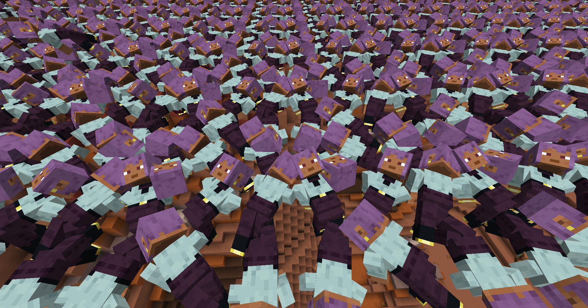

[日本語](README.ja.md)

# PlayerCorpseBlock

Leaves a corpse behind when a player dies. Corpses are blocks with a block entity instead of entities, so a
battlefield full of bodies costs about as much as a pile of chests.

## Requirements

- Minecraft 1.20.1, Fabric or Forge
- Fabric API (Fabric only, required)
- Has to be installed on both the client and the server

## Player Corpse (block)

- Placed automatically where a player dies; it cannot be crafted
- Shows the dead player lying on the ground, wearing their own skin, in one of four poses
- One block holds two bodies: the first fills the lower half like a slab, the second turns the block into a
  full cube
- Breaking: any player can break it, and it drops nothing
- Right clicking does nothing on its own, so blocks and corpses can be placed against it as usual
- Corpses beyond `renderDistance` are not drawn, and beyond `detailDistance` they lose their outer skin
  layer; bodies buried inside a mound are skipped entirely. Those are the knobs to turn when a huge pile
  costs frames

## Corpse item

- Available in the creative inventory (Functional Blocks) and by picking a corpse
- Carries the bodies of the corpse it was picked from in its NBT, so placing it puts the same players back
- Stacks like a slab: used on a corpse block that holds one body, it fills the upper half
- Drawn as the bodies it actually carries, skins included
- Placing an item that carries no bodies creates the corpse of whoever placed it

## What happens when a player dies

- Items and experience drop exactly like vanilla; nothing is stored inside the corpse
- The body appears **exactly where the player died**, mid air included; it never drops to the ground
- Dying in the same spot again fills the upper half of that block, then the block above it, and so on
- Only when that whole column is full does the body move to the closest free column within `pileRadius`
- A body is laid out along the direction the player was looking, with a little random rotation
- Corpses are never placed inside a living player or mob
- Deaths in the void put the body on the surface instead of losing it

## Configuration

Written to `config/playercorpseblock.properties` on first launch (client and server each have their own).

| Key | Default | Meaning |
| --- | --- | --- |
| `enabled` | `true` | Place a corpse when a player dies |
| `pileRadius` | `2` | How far a body may be moved aside when its own column is full |
| `maxPileHeight` | `24` | How many corpse blocks may stack in one column (two bodies each) |
| `despawnSeconds` | `0` | Corpses vanish after this many seconds, `0` keeps them forever |
| `renderDistance` | `32` | Client only, corpses further away are not drawn |
| `detailDistance` | `16` | Client only, corpses further away are drawn without their outer skin layer |
| `cullHiddenCorpses` | `true` | Client only, skip corpses that are covered on all six sides |
